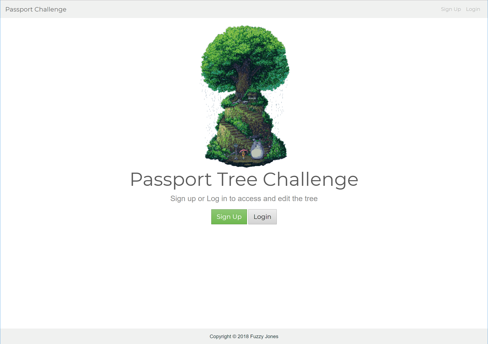
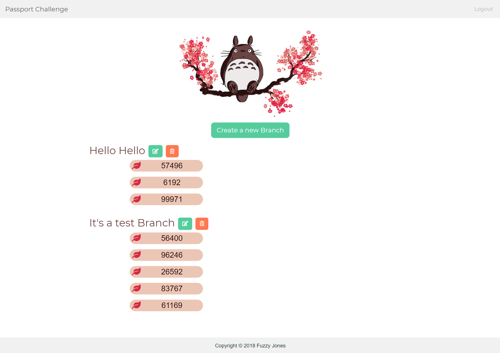

# passport-challenge

* Demonstrate ​your ​knowledge ​of ​several ​technologies, ​including ​databases, ​backend ​design, ​and ​UI/UX ​by
creating ​a ​live-updating ​tree ​view ​as ​a ​web ​application.

## Technologies
### MERN STACK
* Mongo DB
* Express
* Node.js
* React

## Dependencies
* bcryptjs
* body-parser
* concurrently
* express
* jsonwebtoken
* mongoose
* nodemon
* passport
* passport-jwt
* validator
* axios
* classnames
* jwt-decode
* react
* react-dom
* react-redux
* react-router-dom
* react-scripts
* redux
* redux-thunk

## Hosting

* mLab
* Heroku

## Challenge Requirements

* The ​tree ​should ​contain ​a ​group ​of ​nodes, ​with ​a
main ​(root) ​node ​that ​can ​have ​any ​number ​of
‘factories’.

* These ​factory ​nodes ​can ​in ​turn ​generate ​a ​set
amount ​of ​random ​numbers ​(up ​to ​15),
represented ​as ​child ​nodes ​of ​their ​respective
factories.

* Factories ​and ​children ​should ​be ​created
through ​some ​means ​of ​user ​input ​(right ​click,
button ​press, ​etc) ​specifying ​the ​number ​of
children ​to ​generate ​(up ​to ​15) ​and ​the ​ranges ​of
those ​children.

* Factories ​should ​have ​an ​adjustable ​name
assigned ​to ​them, ​be ​removable, ​and ​have ​an
adjustable ​lower ​and ​upper ​bound ​for ​the
random ​number ​generation.

* You ​may ​use ​any ​programming ​languages ​and
front-end ​design ​styles ​of ​your ​choosing ​to
create ​the ​project.

* All ​users ​should ​see ​any ​changes ​made ​to
the ​tree ​immediately ​across ​browsers
without ​refreshing ​or ​polling.

* The ​state ​of ​the ​tree ​should ​remain
persistent; ​reloading ​should ​not ​undo ​any
state.

* All ​of ​a ​factory’s ​existing ​child ​nodes ​should
be ​removed ​upon ​each ​new ​generation.

* Your ​project ​should ​be ​secure, ​validate
inputs, ​and ​protect ​against ​injections.

* Your ​project ​should ​be ​hosted ​on ​the ​web
using ​a ​service ​such ​as ​Amazon ​AWS ​or
Heroku ​to ​run ​your ​submission.

* The ​project ​should ​exhibit ​both ​a ​frontend
and ​backend ​codebase ​built ​by ​you.

* Use ​a ​database ​on ​your ​backend, ​not ​Firebase.

* Please ​submit ​your ​project, ​link, ​and ​source
to ​the ​email ​listed ​below.

## Screen Grabs

